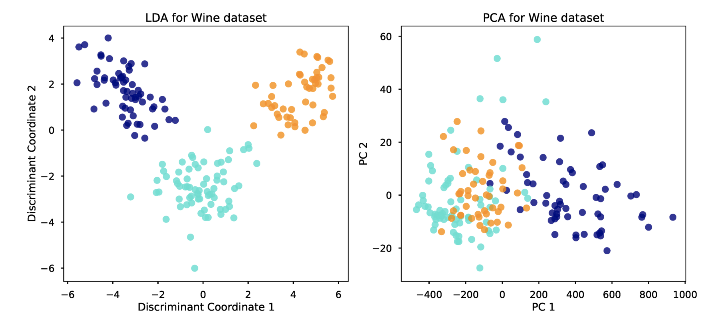

```{r setup, include=FALSE}
knitr::opts_chunk$set(echo = TRUE)
```

#### Linear discriminant analysis (LDA) is similar to PCA in the way that it reduces the number of variables. But where PCA reduces the of variables by grouping them by correlation, LDA focuses on increasing the separability of the known groups. The goal of LDA is to maximise the distance of the group means or centroids and minimise the groups spread.



#### The plot above show a wine classification problem using LDA and PCA. The data set used contained three different type of wine with 13 variables. LDA and PCA make it possible to veiw this 13 dimentional problem on a 2D plot. As you can see the LDA plot has a clear separation of groups, where as the PCA has no clear separation of groups.